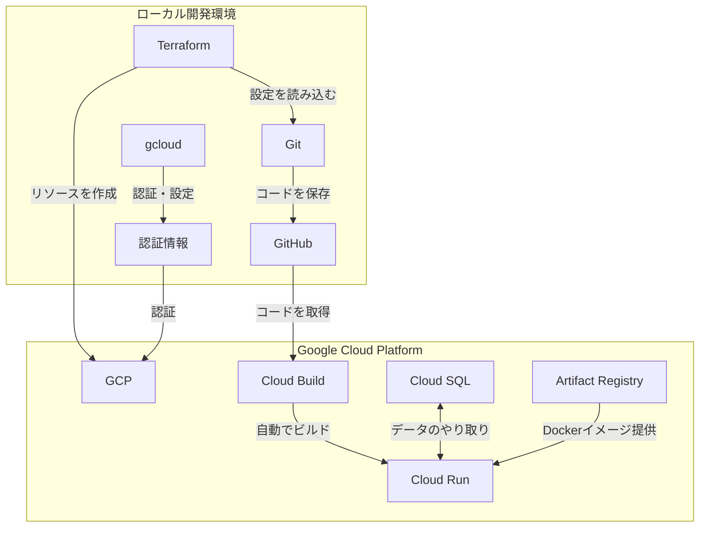

# GCPプロジェクトのセットアップ手順

こんにちは！このドキュメントでは、私たちのプロジェクトで使う道具（ツール）の準備方法と、実際に行った手順を説明します。

## 使う道具たち

まず、私たちが使う主な道具を紹介します：

1. **Git**：コードを保存して管理する道具
   - コードの変更履歴を記録します
   - チームで協力して作業するのに役立ちます
   - バージョン：2.39.3

2. **GitHub**：インターネット上のGitの保管庫
   - みんなのコードを一つの場所で管理します
   - 他の人と簡単に共有できます
   - リポジトリ：e2e-with-gcp-survey

3. **Terraform**：クラウドの設備を作る道具
   - 必要な設備を自動で作ります
   - 設定をコードとして管理できます
   - バージョン：1.5.7

4. **Google Cloud Platform (GCP)**：Googleのクラウドサービス
   - アプリケーションを動かす場所を提供します
   - データを保存したり、計算したりする機能があります
   - プロジェクトID：e2e-with-gcp-survey

## 道具たちの協力関係

これらの道具がどのように協力して働くのか、図で見てみましょう：



## 実際に行った設定手順

### 1. Gitの設定
最初に、コードをGitHubで管理するための設定を行いました：

```bash
# GitHubリポジトリの設定を確認
git remote -v
# 結果：
# origin  git@github.com:emrum01/e2e-with-gcp-survey.git (fetch)
# origin  git@github.com:emrum01/e2e-with-gcp-survey.git (push)

# メインブランチを作成してGitHubに送信
git branch -M main
git push -u origin main
```

### 2. GCPの設定
次に、GCPを使うための認証設定を行いました：

```bash
# GCPにemrum01@gmail.comでログイン
gcloud auth login emrum01@gmail.com

# プロジェクトの設定
gcloud config set project e2e-with-gcp-survey

# アプリケーションのデフォルト認証設定
gcloud auth application-default login
```

### 3. Terraformの設定
Terraformの状態を保存するための設定を行いました：

```hcl
# backend.tf
terraform {
  backend "gcs" {
    bucket = "e2e-with-gcp-survey-tfstate"
    prefix = "terraform/state"
  }
}
```

## 作られた設備（リソース）

このセットアップで、以下の設備が作られました：

1. **VPCネットワーク**
   - 名前：survey-vpc-dev
   - 用途：アプリケーション専用の安全な通信路
   - 特徴：外部からの不正なアクセスを防ぐ

2. **Cloud SQL**
   - インスタンス名：survey-db-dev
   - データベース：PostgreSQL 15
   - 用途：アンケートの回答を保存

3. **Cloud Run**
   - サービス名：
     - survey-backend-dev（バックエンド）
     - survey-frontend-dev（フロントエンド）
   - 特徴：必要に応じて自動で拡張

4. **Cloud Build**
   - トリガー名：
     - survey-backend-dev
     - survey-frontend-dev
   - 監視対象：mainブランチへのプッシュ

## 大切なポイント

1. **アカウントの使い分け**
   - 開発作業は一貫してemrum01@gmail.comで実施
   - 他のアカウントでの操作は避ける

2. **設定の順序**
   - まずGitHubの設定
   - 次にGCP認証
   - 最後にTerraform実行

3. **リソースの命名規則**
   - プロジェクト名: e2e-with-gcp-survey
   - 環境識別子: dev
   - リソース種別-名前-環境の形式

## トラブルシューティング

実際に遭遇した問題と解決方法：

1. **認証エラー**
   ```
   ERROR: (gcloud.services.enable) [account] does not have permission
   ```
   - 解決：正しいアカウント（emrum01@gmail.com）で認証を行う

2. **Terraformエラー**
   ```
   Error: Failed to get existing workspaces
   ```
   - 解決：認証情報を更新し、正しいアカウントで実行

## 次のステップ

1. **アプリケーションのデプロイ**
   - バックエンドのビルドとデプロイ
   - フロントエンドのビルドとデプロイ

2. **動作確認**
   - エンドポイントの疎通確認
   - データベース接続の確認

3. **モニタリング設定**
   - ログの確認方法
   - アラートの設定

これで基本的なセットアップは完了です！このドキュメントは、実際の作業手順と結果を元に作成されています。
